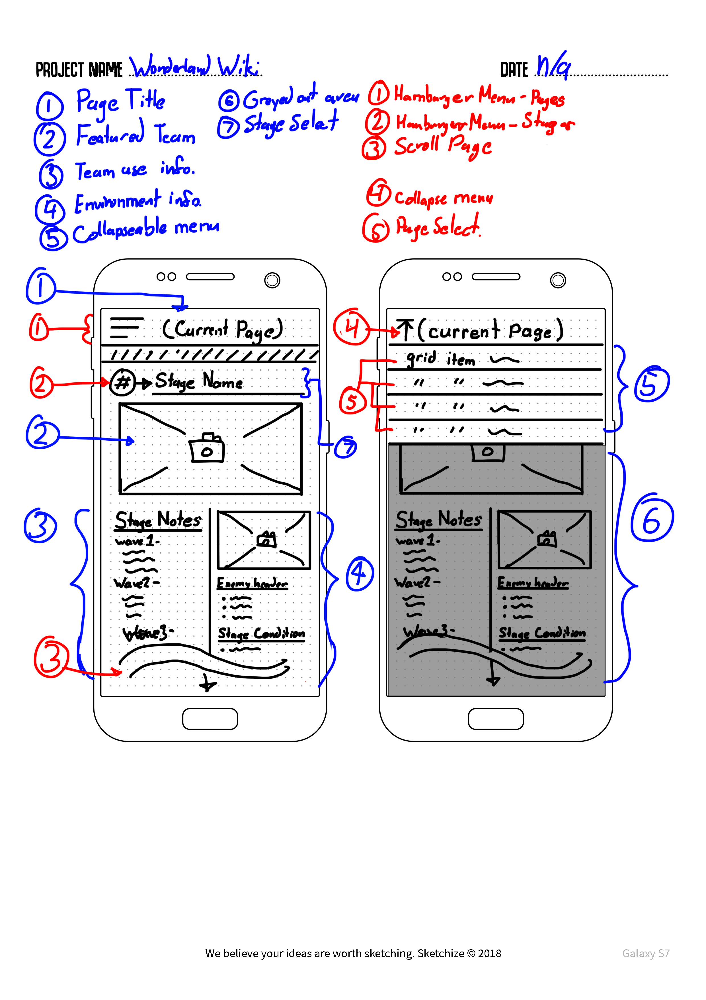
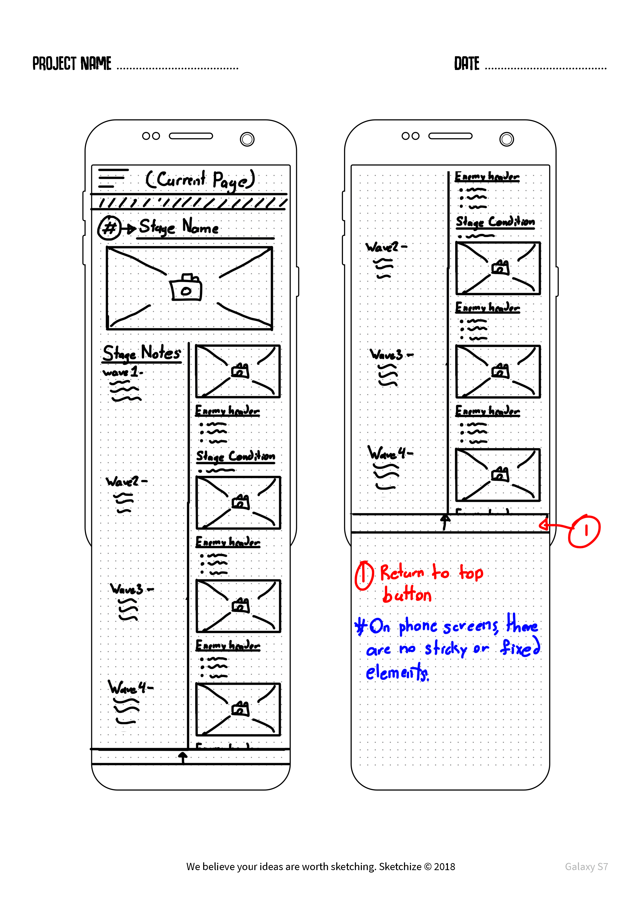
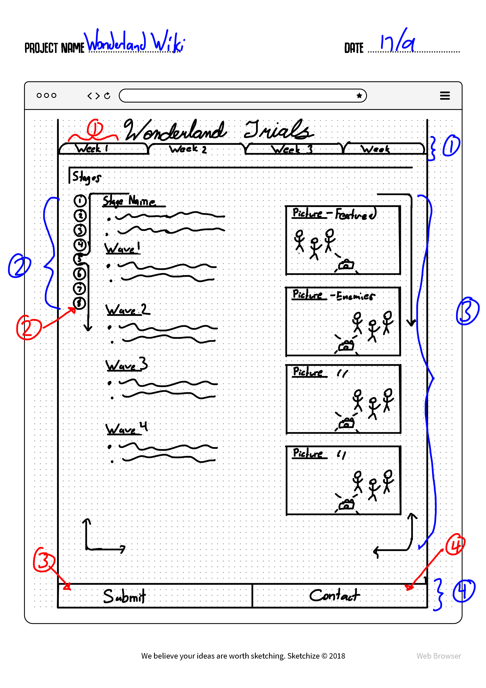

# DGL203 Semester Project

## Overview
For my Semester Project, I plan to create a website that serves as an archive for teams, information, and compositions implemented in Sdorica's Wonderland Trials; an event that changes weekly to pose different challenges to the player.

To explain briefly, Sdorica as a mobile game has weekly levels dubbed the Wonderland Trials, where there are 36 different levels that are divided into 8 levels per week, over a span of four weeks. These levels have fixed properties and conditions, while additional boons can be implemented per week.

The player is limited to using a single team arrangement per stage, where the same team cannot be used concurrently for the remainder of levels; therefore, the goal is for the player to maximize their score total using different arrangements of characters over the span of 8 stages.

## Project Background

The problem that the website plans to solve is the need for recordkeeping as the stages rotate on a weekly basis. It's difficult to remember which stages are currently on rotation, what challenges are within them, which teams are appropriate where, and what the teams were even used 4 weeks prior on the previous rotation. There are individuals who do keep their own notes, but do not co-operatively share solutions in the competitive environment, and this serves only to frustrate people who are looking for help. 

In order to solve this, the website will feature information of the weekly stages, the solutions for them used for the current week, and a history of solutions for them used in weeks past.

## Deliverables and Goals

With this, I would hope that the website would serve to save time and effort spent in attempting these weekly stages as a resource to reference without rediscovering the stage challenges each week.

In doing this project, the pieces that I plan to complete would have to be done incrementally per week. As the week rotates, I would have to acquire the information and record it to present on the website as it becomes available to collect. Ideally, all of the necessary information would be collected in a month, while I do have a backlog of teams kept in notes for a least 3 months prior to this project beginning.

## Wireframes and Methods

In this section of the project proposal, I will do an overview about my layout and the methods I intend to use to accomplish them. In the first wireframe pictured below, we have the standard phone interface, and I will cover the labeled parts incrementally.

Blue Labeled Features are non-actionable elements that the user does not interact with, while red features are actionable elements such as buttons and scrolling.

### Blue Labeled Features

1. Page Title
    - The page title grabs the class of the current active div, while not strictly a new page, displays the appropriate content of the selected week.
2. Featured Team
    - A picture that is shown together with the selected Page Title
3. Team Use Information
    - A section within a grid that displays the information of the team within the current active div.
4. Environmental Information
    - Similar to the team use, contains all the information not pertaining to the team.
5. Collapsible Menu
    - A hamburger menu that shows when the first red feature is clicked upon.

### Red Labeled Features

1. Hamburger Menu
    - A hamburger menu that contains an unordered list of links that will populate the second sub-list menu with the appropriately selected stages of the selected week.
2. Sub-List Menu
    - A second hamburger menu that selects the appropriate stage within the week and populates the rest of the content with it.
3. Scroll Page
    - Nothing out of the ordinary here, the user is able to scroll the page.
4. Collapse Menu
    - Essentially the same as the hamburger menu, the user is able to collapse the menu once it is opened.
5. Page Select
    - Yet another common function of the hamburger menu once opened, you are able to select the desired week to view once you click on it.

### Red Labeled Features

1. Return to Top
    - At the bottom of the phone page, there is a button to return to the top of the page.

and a description of the methods you intend to use to accomplish the project

### Features

1. Navigation Bar
    - Highlighted as the same blue 1 in the phone wireframe, the navigation bar is built on a styled unordered list.
2. Sub-Navigation Bar
    - Highlighted as the red 2 in the phone wireframe, this is a second navigation list that the user is able to select the appropriate stage within the week given.
3. Stage Information
    - The information is populated with the appropriate images and content from the selected week and stage in the previous navigation.
4. Footer
    - Contains a Submit button that opens a form modal to submit a team, and a contact button that opens another modal with contact information.
